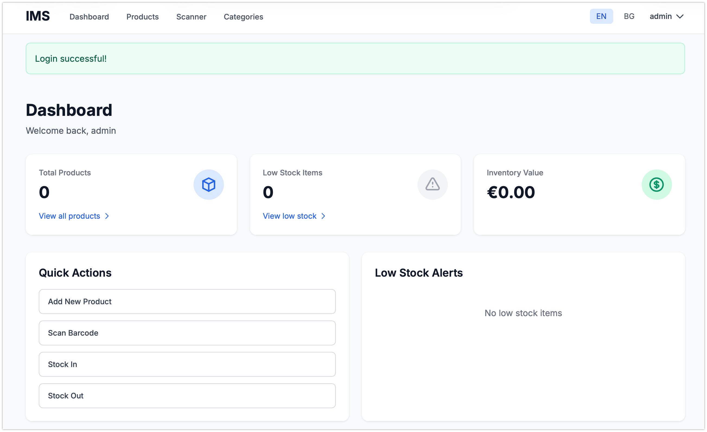
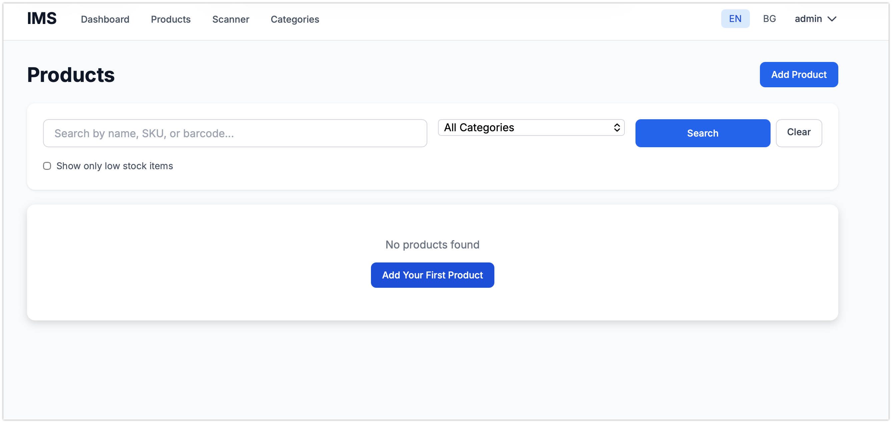
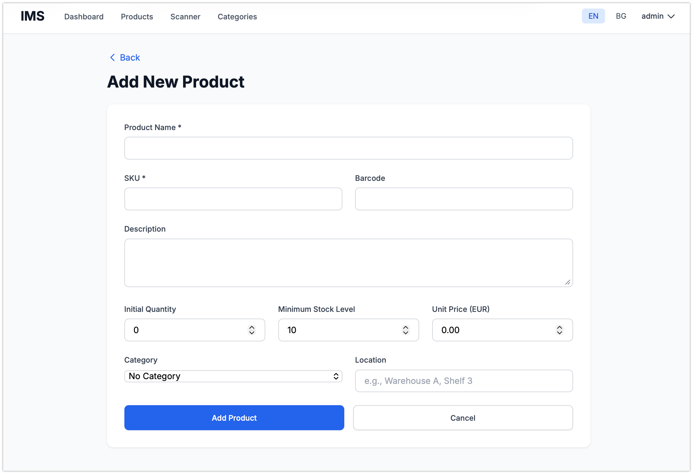
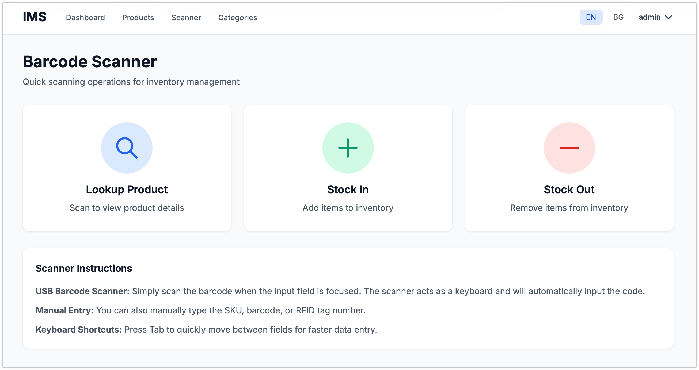
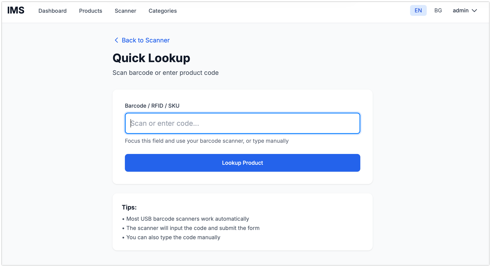
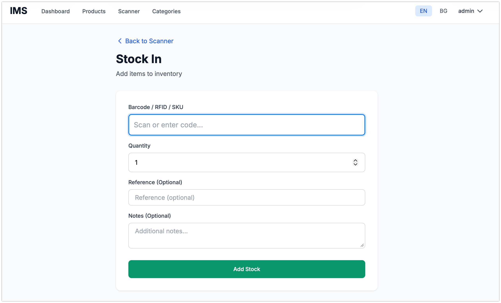
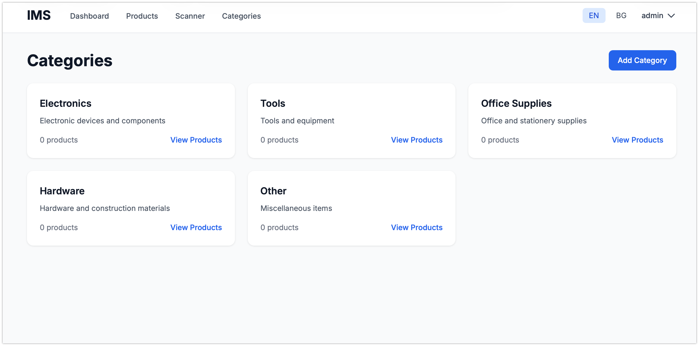
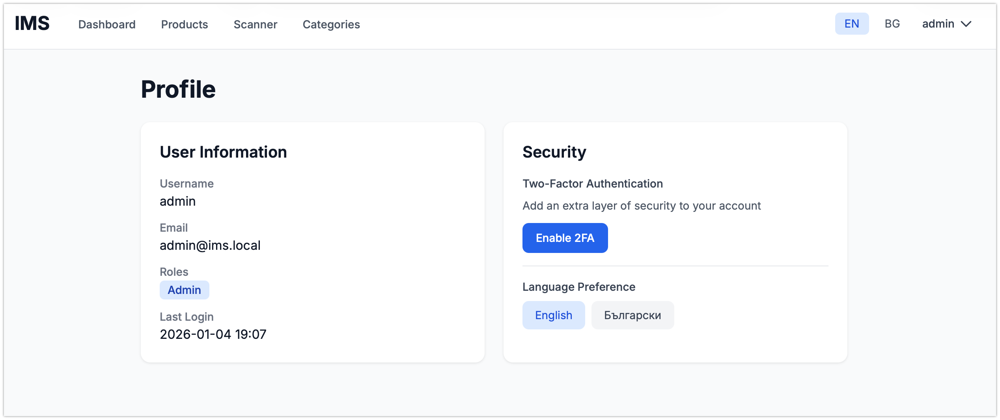
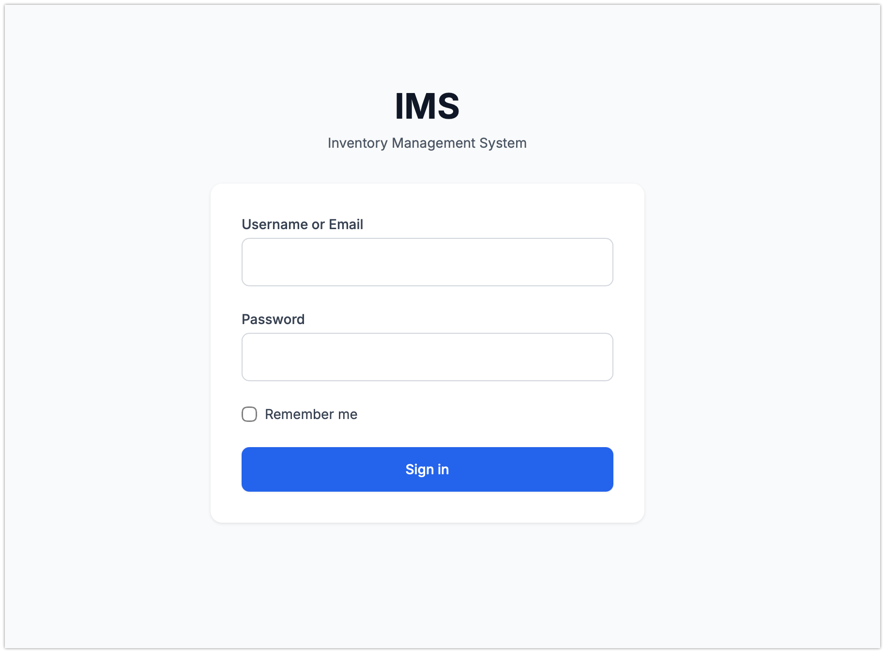

# LightStock - Inventory Management System

A lightweight, secure web-based Inventory Management System with barcode/RFID scanning capabilities, featuring a minimalistic Apple-inspired interface.

## Screenshots

<div align="center">

### Dashboard


### Product Management



### Scanner Interface




### Other Features




</div>

## Features

- **Product Management**: Add, edit, delete, and search products with bilingual support (English/Bulgarian)
- **Barcode/RFID Scanning**: Quick lookup and stock operations via USB scanners
- **Authentication & Security**:
  - Secure user authentication with bcrypt password hashing
  - Two-Factor Authentication (2FA) with Google Authenticator
  - Role-based access control (Admin, Manager, Staff)
  - Rate limiting and CSRF protection
- **Internationalization**: Full bilingual support (English/Bulgarian)
- **Dashboard**: Real-time inventory stats, low stock alerts, recent activities
- **Stock Management**: Track stock movements with full audit trail
- **Mobile-Responsive**: Works seamlessly on phones, tablets, and desktops

## Technology Stack

- **Backend**: Python 3.11+ with Flask
- **Database**: SQLite (development/production)
- **Frontend**: Tailwind CSS, Vanilla JavaScript
- **Authentication**: Flask-Security-Too with 2FA
- **i18n**: Flask-Babel

## Documentation

- **[DOCKER.md](DOCKER.md)** - Docker deployment guide (recommended)
- **[QUICKSTART.md](QUICKSTART.md)** - Quick start guide for getting up and running
- **[DEPLOYMENT.md](DEPLOYMENT.md)** - Comprehensive deployment guide for AWS Lightsail
- **[TROUBLESHOOTING.md](TROUBLESHOOTING.md)** - Common issues and solutions
- **[CLAUDE.md](CLAUDE.md)** - Project specification and development guidelines

## License

This project is licensed under the MIT License - see the [LICENSE](LICENSE) file for details.

## Author

**Georgi Isaev** - [georgi-i](https://github.com/georgi-i)

## Installation

### Option 1: Docker (Recommended)

The fastest way to get started:

```bash
# Clone the repository
git clone https://github.com/georgi-i/light-stock.git
cd light-stock

# Copy environment file and configure
cp .env.docker .env
nano .env  # Update SECRET_KEY and other settings

# Start with Docker Compose
docker-compose up -d

# Initialize database
docker-compose exec lightstock python init_db.py
```

Access at **http://localhost:8000**

📖 **[Full Docker Guide](DOCKER.md)**

### Option 2: Manual Installation

**Prerequisites:**
- Python 3.11 or higher
- pip (Python package manager)
- Virtual environment (recommended)

**Setup Steps:**

1. **Clone the repository**
   ```bash
   git clone https://github.com/georgi-i/light-stock.git
   cd light-stock
   ```

2. **Create and activate virtual environment**
   ```bash
   python3 -m venv venv
   source venv/bin/activate  # On Windows: venv\Scripts\activate
   ```

3. **Install dependencies**
   ```bash
   pip install -r requirements.txt
   ```

4. **Set up environment variables**
   ```bash
   cp .env.example .env
   ```

   Edit `.env` and update the following:
   - `SECRET_KEY`: Generate a secure random key
   - `SECURITY_PASSWORD_SALT`: Generate a secure salt
   - `SECURITY_TOTP_SECRETS`: Generate TOTP secret

   To generate secure keys, run:
   ```python
   python -c "import secrets; print(secrets.token_hex(32))"
   ```

5. **Initialize the database**
   ```bash
   python init_db.py
   ```

   This will:
   - Create database tables
   - Set up default roles (Admin, Manager, Staff)
   - Create an admin user (you'll be prompted for credentials)
   - Create default product categories

6. **Run the application**
   ```bash
   python run.py
   ```

   Or using Flask CLI:
   ```bash
   flask run
   ```

7. **Access the application**

   Open your browser and navigate to: `http://localhost:8000`

## Default Login

After initialization, log in with the admin credentials you created during the `init_db.py` step.

## Usage Guide

### Adding Products

1. Navigate to **Products** → **Add Product**
2. Fill in product details (both English and Bulgarian names)
3. Set SKU, barcode, quantity, and other fields
4. Click **Add Product**

### Barcode Scanning

1. Navigate to **Scanner** menu
2. Choose operation:
   - **Quick Lookup**: Find product by scanning
   - **Stock In**: Add items to inventory
   - **Stock Out**: Remove items from inventory
3. Focus the input field and scan with your USB barcode scanner
4. The scanner will automatically input the code

### Setting up 2FA

1. Go to **Profile**
2. Click **Enable 2FA**
3. Scan the QR code with Google Authenticator or similar app
4. Enter the 6-digit code to verify
5. 2FA is now active for your account

### Managing Users (Admin Only)

1. Navigate to the user menu → **Users**
2. View all users, their roles, and 2FA status
3. Users can self-register or be added by admins

## Project Structure

```
light-stock/
├── app/
│   ├── __init__.py          # Flask app factory
│   ├── models.py            # Database models
│   ├── auth.py              # Authentication routes
│   ├── inventory.py         # Inventory routes
│   ├── scanner.py           # Scanner routes
│   ├── routes.py            # Main routes
│   ├── utils.py             # Utility functions
│   └── templates/           # HTML templates
│       ├── base.html
│       ├── dashboard.html
│       ├── auth/
│       ├── inventory/
│       └── scanner/
├── config.py                # Configuration
├── run.py                   # Application entry point
├── init_db.py               # Database initialization
├── requirements.txt         # Python dependencies
├── .env.example            # Environment variables template
└── README.md               # This file
```

## Security Features

- **Password Security**: Bcrypt hashing with minimum 12 characters
- **Two-Factor Authentication**: Optional TOTP-based 2FA
- **CSRF Protection**: All forms protected against CSRF
- **Rate Limiting**: Authentication endpoints rate-limited
- **Session Security**: Secure, HTTPOnly, SameSite cookies
- **Audit Logging**: All critical actions logged
- **Input Validation**: All user inputs sanitized
- **SQL Injection Protection**: Parameterized queries via SQLAlchemy ORM

## Development

### Running in Development Mode

```bash
export FLASK_ENV=development
flask run --debug
```

### Database Migrations

```bash
flask db init
flask db migrate -m "Description of changes"
flask db upgrade
```

### Adding Translations

1. Extract translatable strings:
   ```bash
   pybabel extract -F babel.cfg -o messages.pot .
   ```

2. Update translations:
   ```bash
   pybabel update -i messages.pot -d translations
   ```

3. Compile translations:
   ```bash
   pybabel compile -d translations
   ```

## Deployment (AWS Lightsail)

Deployment instructions will be provided in a separate deployment guide. The application is optimized for AWS Lightsail's $3.50-$5/month tier.

## Contributing

This is an open-source project. Contributions are welcome!

## License

MIT License - See LICENSE file for details

## Support

For issues, questions, or contributions, please open an issue on the repository.

---

**Built with ❤️ for efficient inventory management**
